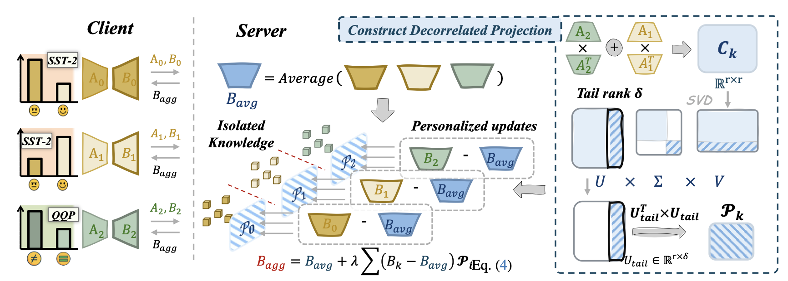
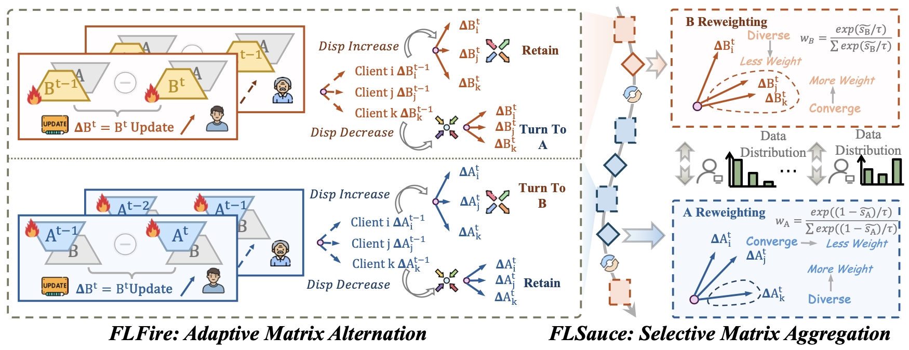








# Short Bio

Hi there! This is Wenwen He (何文文), I am a first-year graduate student at [School of Computer Science at Wuhan University](https://cs.whu.edu.cn/), advised by Prof. [Mang Ye](https://scholar.google.com/citations?user=j-HxRy0AAAAJ&hl=zh-CN). Previously, I received my bachelor degree from the [Guangdong University of Technology](https://www.gdut.edu.cn/) in 2024. If you are interested in collaborating with me or want to have a chat, always feel free to contact me through e-mail！

My research mainly focuses on **Federated Learning**, **Large Language Model** and **Trustworthy AI**.

# 🔥 News

<ul>
  <li><em>2025.05:</em> 🌟 SPMC was accepted to <strong>ICML 2025</strong>.</li>
</ul>

# 📝 Publications 

&dagger;: equal contribution, * : corresponding author

<dl>
  <dt></dt>
  <dd><a class="publication-title">SPMC: Self-Purifying Federated Backdoor Defense via Margin Contribution</a></dd>
  <dd><strong>Wenwen He&dagger;</strong>, Wenke Huang&dagger;, Bin Yang*, Shukan Liu, Mang Ye*</dd>
  <dd>International Conference on Machine Learning  <strong>(ICML)</strong>, 2025</dd>
</dl>

## ⌛️ In Submission & Preprint

<dl>
  <dt></dt>
  <dd><a class="submission-title">Batman: Benign Knowledge Alignment Through Malicious Null Space in Federated Backdoor Attack</a></dd>
  <dd><strong>Wenwen He</strong></dd>
  <dd>Under CVPR'26 Review</dd>
</dl>

<dl>
  <dt></dt>
  <dd><a class="submission-title">FedPissa: Towards Federated Personalized Adaptation of Foundation Models via LoRA Subspace Mapping</a></dd>
  <dd><strong>Wenwen He</strong></dd>
  <dd>Under Review</dd>
</dl>

<dl>
  <dt></dt>
  <dd><a class="submission-title">FLoRA-Chef: Making A Good LoRA Recipe in Federated Generalization</a></dd>
  <dd><strong>Wenwen He</strong></dd>
  <dd>Under Review</dd>
</dl>

# 📖 Educations

- *2024.09 - now*, Master Student, School of National Cybersecurity, Wuhan University, China.
- *2020.09 - 2024.06*, Bachelor, School of Computer Science and Technology, Guangdong University of Technology, China.
